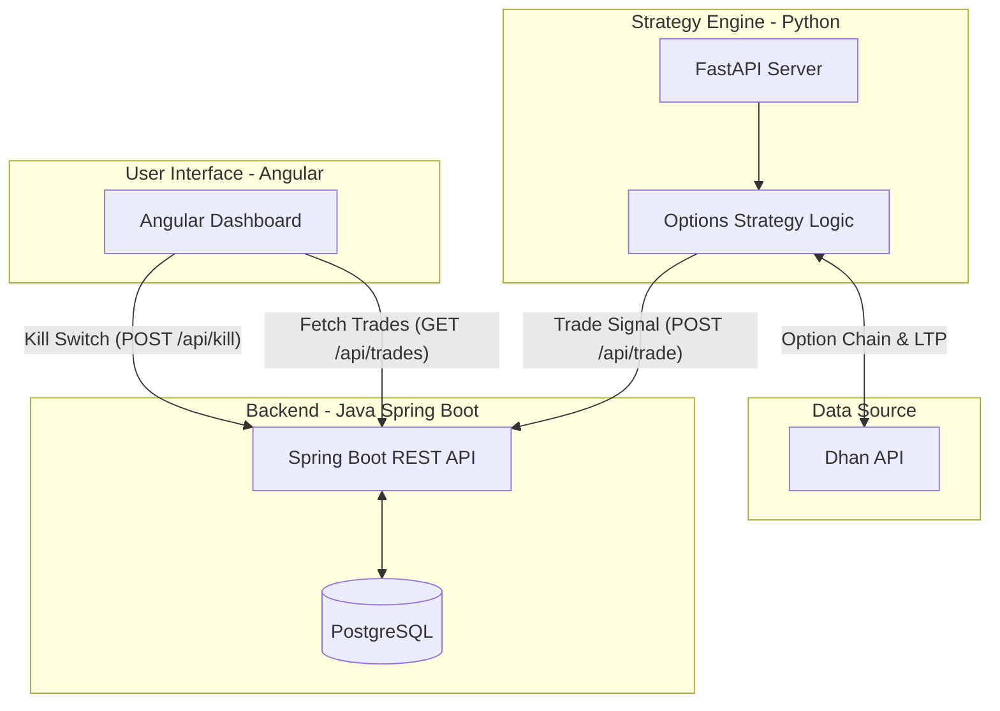

# Algo Trading System - Developer Guide

This document provides a comprehensive overview of the Algo Trading System for developers. It details the system architecture, core components, trading strategy, and setup instructions to help new developers quickly onboard and start contributing.

## 🏗️ System Architecture

The project follows a microservices hybrid architecture separated into three main layers: Strategy Engine, Backend Service, and UI Dashboard.



## 🛠️ Technology Stack

| Component | Technology | Description |
|---|---|---|
| **Frontend** | Angular 17, TypeScript | Reactive UI dashboard for real-time monitoring. |
| **Backend** | Java 17, Spring Boot 3.2.5. Data JPA | Core backend handling persistence and UI APIs. |
| **Strategy Engine** | Python, FastAPI, Pandas | Data ingestion, option chain filtering, and signal generation. |
| **Database** | PostgreSQL 18 | Persistent storage for trades and historical PnL. |
| **Infrastructure** | Docker, Docker Compose | Containerized execution environment. |

---

## 🧩 Core Components Deep-Dive

### 1. Strategy Engine (`/algo-python`)
The intelligence of the system lives here. It periodically checks the market and triggers trades.
*   **`main.py`**: A FastAPI application exposing endpoints like `/run` (to execute the strategy check manually), `/status` (to view internal state), and `/backtest`.
*   **`strategy.py`**: The heartbeat of the system. 
    *   **Strategy Explained (LowX2)**:
        1. Fetches NIFTY Option chain and filters for options with a Premium / Last Traded Price (LTP) $\le$ ₹12.
        2. Retrieves the 7-day or weekly low of the selected option.
        3. Sets a "WAITING" state with an Entry Condition = $2 \times \text{Weekly Low}$.
        4. Monitors live LTP. If LTP $\ge$ Entry Price, it triggers an "EXECUTED" state and sends a signal to the Spring Boot backend with automatically calculated Stop Loss and Targets.
*   **`dhan_api.py`**: Handles all broker integration (Dhan API). Includes methods for fetching option chains, 7-day historical charts, and live market quotes.
*   **`alerts.py` / `ai_filter.py` / `backtest_engine.py`**: Support modules for Telegram notifications, AI-based filtering, and offline backtesting.

### 2. Backend Service (`/algo-backend`)
A standard Java Spring Boot application acting as the broker between the Strategy Engine and the UI.
*   **Endpoints**:
    *   `POST /api/trade`: Receives signals from the Python engine.
    *   `GET /api/trades`: Returns historical and open trades for the UI.
    *   `POST /api/kill`: Toggles a kill switch to pause the strategy.
*   **Database**: Connects to `jdbc:postgresql://postgres:5432/algo`. Automatically updates schema using `spring.jpa.hibernate.ddl-auto=update`.

### 3. UI Dashboard (`/algo-ui`)
A single-page application built with Angular.
*   **`dashboard.component.ts`**: The main terminal interface boasting a dark theme. It polls the backend every 3 seconds to fetch the latest trades.
*   **Metrics**: Dynamically calculates and renders:
    *   Win Rate (%)
    *   Total PnL
    *   Active Trades Count
    *   Live state of historical trades (Target Hit, SL Hit, Open).

---

## 🚀 Setup & Execution

### Option 1: Docker (Recommended)
You can run the entire system via Docker Compose:
1. Ensure Docker is running.
2. In the root directory, create a `.env` file (refer to `.env.example`) and fill in `DHAN_ACCESS_TOKEN`.
3. Run: `docker-compose up --build -d`
4. Access the UI at: **http://localhost:4200**
5. Backend APIs run on `http://localhost:8080`
6. Python APIs run on `http://localhost:8000`

### Option 2: Local Development
If you are developing components locally, run them individually:

**1. PostgreSQL Database**
Create a local database named `algo` with username `postgres` and password `1010` (or update `algo-backend/src/main/resources/application.properties`).

**2. Backend (Spring Boot)**
```bash
cd algo-backend
mvn spring-boot:run
```

**3. Strategy Engine (Python)**
```bash
cd algo-python
python -m venv venv
# Activate venv: `venv\Scripts\activate` (Windows)
pip install -r requirements.txt
uvicorn main:app --reload --port 8000
```

**4. UI (Angular)**
```bash
cd algo-ui
npm install
ng serve
# Navigate to http://localhost:4200
```

---

## 📝 Future Development Guidelines

1. **Adding New Strategies**: Create a new strategy file in `/algo-python` (e.g., `strategy_v2.py`), and expose a new endpoint in `main.py` to trigger it. Ensure the `strategyName` payload is updated when sending the signal to the backend.
2. **Database Changes**: The Spring Boot app uses `update` for DDL generation. For production, switch to Flyway or Liquibase for proper schema migrations.
3. **Broker Integration**: Currently hardcoded to Dhan API (`dhan_api.py`). If extending to new brokers, consider implementing an Abstract Base Class (ABC) in Python to standardise the `get_option_chain` and `get_ltp` methods.
